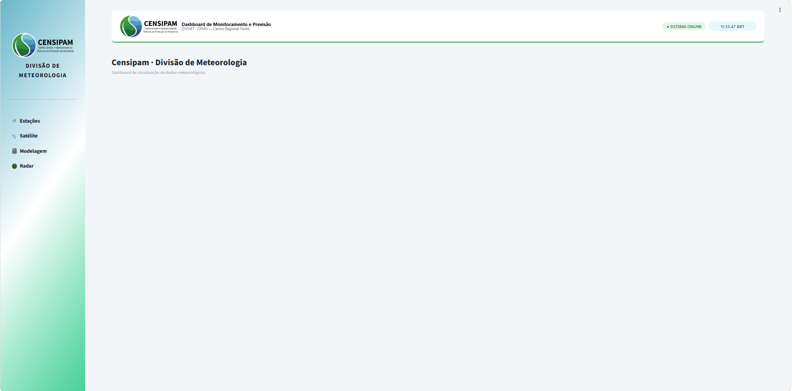
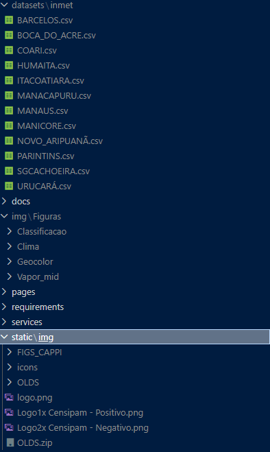

# Nome do Projeto

## Autores
- Paulo Mauricio Moura de Souza
- Gabriel Vinícius Magalhães Pereira

## Visão Geral
- Plataforma meteorológica para visualização de dados ambientais, permitindo a exploração interativa de produtos meteorológicos por meio de dashboards, gráficos, tabelas e imagens.

## Usuários
- Desenvolvido para meteorologistas, mas não exclusivamente, outros profissionais da área ambiental e usuários comuns poderiam utilizá-lo.

## Motivação e Contexto

## Tecnologias Utilizadas
- Python 3.13.9
- Streamlit
- Pandas
- Plotly / Matplotlib
- base64
- babel
- datetime
- regex
- json
- glob
- os

## Arquitetura do Sistema
- Interface: Streamlit
- Estado da aplicação: gerenciado via Streamlit Session State
- Processamento: módulos Python
- Dados: arquivos CSV / IMG / DB

## Instalação

## Interface

## Uso
streamlit run app.py

## Fluxo
1. Abre a aplicação
2. Escolhe a categoria
3. Escolhe o produto da categoria
4. O sistema processa os dados de acordo com o produto selecionado
5. Os resultados são renderizados dinamicamente na interface

## Exemplos

## Estrutura do Código

## Banco de Dados

## API

## Testes

## Roadmap

## Licença

## Observações
- Os dados de planilhas e imagens estão organizados na seguinte estrutura em:
